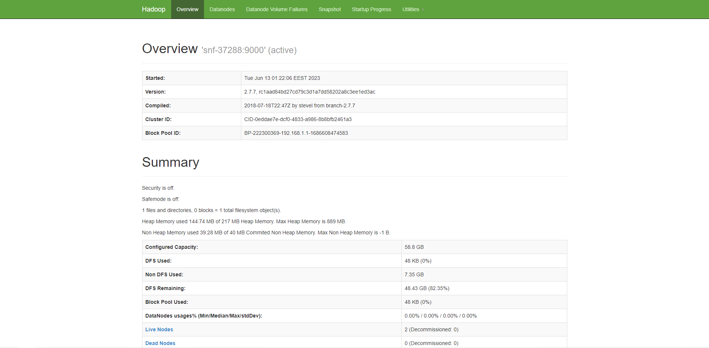

# Apache Hadoop v2.7.7 Installation (on Ubuntu 16.04 LTS)

Follow the steps below for all 3 nodes:

## Preparation

### Update the source list of Ubuntu

```sh
sudo apt update
```

### Install SSH

```sh
sudo apt install ssh
```

### Setup passwordless login between all nodes

```sh
ssh-keygen -t rsa -P '' -f ~/.ssh/id_rsa
```

```sh
cat .ssh/id_rsa.pub >> ~/.ssh/authorized_keys
```

```sh
# From master node
scp .ssh/authorized_keys 192.168.1.2:~/.ssh/authorized_keys
scp .ssh/authorized_keys 192.168.1.3:~/.ssh/authorized_keys
```

```sh
# From slave node 1
scp .ssh/authorized_keys 192.168.1.1:~/.ssh/authorized_keys
scp .ssh/authorized_keys 192.168.1.3:~/.ssh/authorized_keys
```

```sh
# From slave node 2
scp .ssh/authorized_keys 192.168.1.1:~/.ssh/authorized_keys
scp .ssh/authorized_keys 192.168.1.2:~/.ssh/authorized_keys
```

### Add all nodes to `/etc/hosts`

```sh
sudo vim /etc/hosts
```

Add the following lines:

```sh
192.168.1.1 snf-37288
192.168.1.2 snf-37291
192.168.1.3 snf-37293
```

### Install JDK1.8 on all 3 nodes

```sh
sudo apt -y install openjdk-8-jdk-headless
```

```sh
java -version
```

## Download and install Apache Hadoop

### Apache Hadoop installation on all nodes

```sh
wget https://archive.apache.org/dist/hadoop/common/hadoop-2.7.7/hadoop-2.7.7.tar.gz
```

```sh
tar -xzf hadoop-2.7.7.tar.gz
```

### Apache Hadoop configuration - Setup environment variables

```sh
vim ~/.bashrc
```

Add the following lines:

```sh
export HADOOP_HOME=~/hadoop-2.7.7
export PATH=$PATH:$HADOOP_HOME/bin
export PATH=$PATH:$HADOOP_HOME/sbin
export HADOOP_MAPRED_HOME=${HADOOP_HOME}
export HADOOP_COMMON_HOME=${HADOOP_HOME}
export HADOOP_HDFS_HOME=${HADOOP_HOME}
export YARN_HOME=${HADOOP_HOME}
```

```sh
source ~/.bashrc
```

## Configure Apache Hadoop Cluster

### Update `hadoop-env.sh`

```sh
vim ~/hadoop-2.7.7/etc/hadoop/hadoop-env.sh
```

Replace `export JAVA_HOME=${JAVA_HOME}` with:

```sh
export JAVA_HOME=/usr/lib/jvm/java-8-openjdk-amd64
```

### Update `core-site.xml`

```sh
vim ~/hadoop-2.7.7/etc/hadoop/core-site.xml
```

Add the following lines:

```xml
<configuration>
    <property>
        <name>fs.defaultFS</name>
        <value>hdfs://192.168.1.1:9000</value>
    </property>
</configuration>
```

### Update `hdfs-site.xml`

```sh
vim ~/hadoop-2.7.7/etc/hadoop/hdfs-site.xml
```

Add the following lines:

```xml
<configuration>
    <property>
        <name>dfs.replication</name>
        <value>2</value>
    </property>
    <property>
        <name>dfs.namenode.name.dir</name>
        <value>file:///usr/local/hadoop/hdfs/data</value>
    </property>
    <property>
        <name>dfs.datanode.data.dir</name>
        <value>file:///usr/local/hadoop/hdfs/data</value>
    </property>
</configuration>
```

### Update `yarn-site.xml`

```sh
vim ~/hadoop-2.7.7/etc/hadoop/yarn-site.xml
```

Add the following lines:

```xml
<configuration>
    <property>
        <name>yarn.nodemanager.aux-services</name>
        <value>mapreduce_shuffle</value>
    </property>
    <property>
        <name>yarn.nodemanager.aux-services.mapreduce.shuffle.class</name>
        <value>org.apache.hadoop.mapred.ShuffleHandler</value>
    </property>
    <property>
       <name>yarn.resourcemanager.hostname</name>
       <value>192.168.1.1</value>
    </property>
</configuration>
```

### Update `mapred-site.xml`

```sh
vim ~/hadoop-2.7.7/etc/hadoop/mapred-site.xml
```

Add the following lines:

```xml
<configuration>
    <property>
        <name>mapreduce.jobtracker.address</name>
        <value>192.168.1.1:54311</value>
    </property>
    <property>
        <name>mapreduce.framework.name</name>
        <value>yarn</value>
    </property>
</configuration>
```

### Create `data` folder

```sh
sudo mkdir -p /usr/local/hadoop/hdfs/data
```

```sh
sudo chown user:user -R /usr/local/hadoop/hdfs/data
```

```sh
chmod 700 /usr/local/hadoop/hdfs/data
```

## Create master and workers (slaves?) files

### Create master file

```sh
vim ~/hadoop-2.7.7/etc/hadoop/masters
```

Add the following line:

```sh
192.168.1.1
```

### Create slaves file

```sh
vim ~/hadoop-2.7.7/etc/hadoop/slaves
```

Add the following lines:

```sh
192.168.1.2
192.168.1.3
```

## Format HDFS and start Hadoop Cluster

### Format HDFS

On name node:

```sh
hdfs namenode -format
```

### Start HDFS cluster

```sh
start-dfs.sh
```

On name node, running `jps` should list:

```sh
# If "Master" shows up here, it corresponds to the Spark master
Jps
NameNode
SecondaryNameNode
```

On data nodes, running `jps` should list:

```sh
# If "Worker" shows here, this corresponds to a Spark worker
Jps
DataNode
```

And by accessing `http//83.212.81.77:50070` you should see the following namenode web UI:



### Upload file to HDFS

```sh
echo "Hello, world!" > hello.txt
```

```sh
hdfs dfs -mkdir /hello
```

```sh
hdfs dfs -put hello.txt /hello/hello.txt
```

```sh
# Ensure this command works from all nodes
hdfs dfs -cat /hello/hello.txt
```

### Stopping HDFS cluster

```sh
stop-dfs.sh
```
