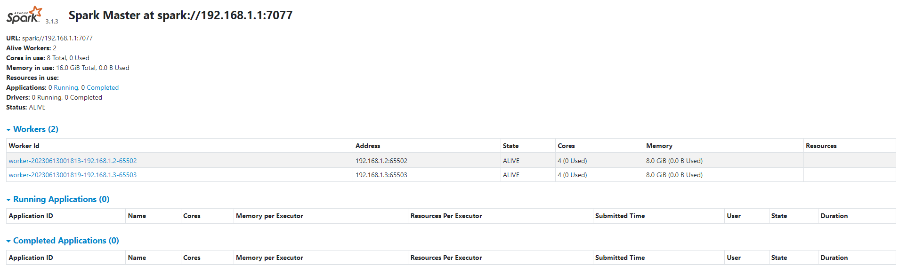

# Apache Spark v3.1.3 Installation (on Ubuntu 16.04 LTS)

Follow the steps below for all 3 nodes:

## Install python3.8

```sh
sudo apt update
```

```sh
sudo apt install build-essential zlib1g-dev libncurses5-dev libgdbm-dev
libnss3-dev libssl-dev libreadline-dev libffi-dev libsqlite3-dev wget libbz2-dev
```

```sh
wget https://www.python.org/ftp/python/3.8.0/Python-3.8.0.tgz
```

```sh
tar -xf Python-3.8.0.tgz
```

```sh
cd Python-3.8.0
```

```sh
./configure --enable-optimizations
```

```sh
make -j 4
```

```sh
sudo make altinstall
```

```sh
python3.8 --version # You should expect: Python 3.8.0
```

```sh
# Delete old links

sudo rm -rf /usr/bin/python3.5
sudo rm -rf /usr/bin/python3.5m
sudo rm -rf /usr/lib/python3.5
sudo rm -rf /etc/python3.5
sudo rm -rf /usr/local/lib/python3.5
```

## Install pip

```sh
cd ../
```

```sh
wget https://bootstrap.pypa.io/get-pip.py
```

```sh
python3.8 get-pip.py
```

## Install PySpark

```sh
pip3.8 install pyspark==3.1.3
```

## Install Apache Spark

```sh
wget https://archive.apache.org/dist/spark/spark-3.1.3/spark-3.1.3-bin-hadoop2.7.tgz
```

```sh
tar -xzf spark-3.1.3-bin-hadoop2.7.tgz
```

```sh
vim ~/.bashrc
```

Add the following lines:

```sh
export SPARK_HOME=/home/user/spark-3.1.3-bin-hadoop2.7
export PATH=$PATH:$SPARK_HOME/sbin
export PYSPARK_PYTHON=python3.8
export PYSPARK_DRIVER_PYTHON=python3.8
```

```sh
source ~/.bashrc
```

## Install Java

```sh
sudo apt-get install openjdk-8-jdk
```

```sh
java -version # You should expect: openjdk version "1.8.0_292"
```

## Setup a cluster (1 master, 2 workers)

```sh
cd spark-3.1.3-bin-hadoop2.7/conf
```

```sh
touch spark-env.sh
```

```sh
vim spark-env.sh
```

Add the following line:

```sh
SPARK_MASTER_HOST='192.168.1.1' # Master node IP
```

To start the master node:

```sh
start-master.sh
```

Create custom script for deploying workers:

```sh
mkdir ~/bin
vim ~/bin/custom-workers.sh
```

Master node (192.168.1.1):

```sh
#!/bin/bash

spark-daemon.sh start org.apache.spark.deploy.worker.Worker 1 --webui-port 8080 --port 65501 --cores 4 --memory 8g spark://192.168.1.1:7077
```

Worker node 1 (192.168.1.2):

```sh
#!/bin/bash

spark-daemon.sh start org.apache.spark.deploy.worker.Worker 2 --webui-port 8080 --port 65502 --cores 4 --memory 8g spark://192.168.1.1:7077
```

Worker node 2 (192.168.1.3):

```sh
#!/bin/bash

spark-daemon.sh start org.apache.spark.deploy.worker.Worker 3 --webui-port 8080 --port 65503 --cores 4 --memory 8g spark://192.168.1.1:7077
```

```sh
chmod +x ~/bin/custom-workers.sh
```

To deploy workers (may need to log in again to update PATH variable):

```sh
custom-workers.sh
```

Check that workers have been deployed by visiting http://83.212.81.77:8080/:


